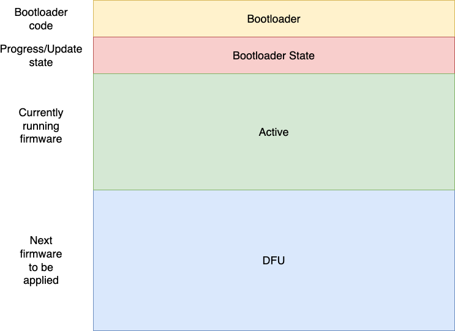

## Bootloader

`embassy-boot` 是一个轻量级引导加载程序，支持以断电保护安全方式升级固件应用程序，并且还具有尝试引导和回滚的功能。

如果你对默认的配置和功能满意，可以将此引导加载程序作为库，或者直接刷入。

在设计上，引导加载程序不提供任何网络功能。通常是用户应用提供网络功能来获取最新的固件，使用此引导加载程序作为更新固件的库，或者使用此引导加载程序作为库并自己添加这个（网络）功能。

此引导加载程序根据 `embedded-storage` 介质实现同时支持内部闪存和外部闪存。也支持验证通过数字签名的固件（推荐这么做）。

## 硬件支持

此引导加载程序支持以下固件：

* 有或没有软设备的 nRF52
* STM32 L4, WB, WL, L1, L0, F3, F7 和 H7
* 树莓派：RP2040

通常此固件程序在所有实现 `embedded-storage` 介质的内部闪存的平台上都可以工作，但是i可能需要一些适配的初始化代码才能工作。

## 设计



此引导加载程序把存储介质分为 4 个主要的分区，可以在创建引导加载程序实例的时候或者通过链接脚本（linker script）来配置：

* BOOTLOADER - 存放引导加载程序的地方，它自己要消耗 8kB 的闪存空间，但是如果你需要调试引导加载程序并且还要有可用空间，就把这个分区增加到 24kB 以使用 probe-rs 运行引导加载程序。


* ACTIVE - 存放主要程序的地方。引导加载程序会尝试从这个分区起始点加载程序，这个分区只能由引导加载程序写入。分区大小取决于你的程序大小。

* DFU - 存放待交换应用程序的地方。这个分区可以由应用程序写入，并且必须至少比 ACTIVE 分区要大一个页面大小，因为交换（swap）算法会使用额外空间来确保安全地复制数据，即使是由于电源原因。

`DFU 分区大小 = ACTIVE 分区大小 + ACTIVE 页面大小`

上述算式的值单位为字节（byte）。

* BOOTLOADER STATE - 引导加载程序存储当前状态的地方，该状态描述了 ACTIVE 分区和 DFU 分区是否需要交换。当一个新的固件写入到了 DFU 分区，同时也会向 BOOTLOADER STATE 写入一个魔数（magic field）来告知引导加载程序要交换分区了。BOOTLOADER STATE 分区必须能存储魔数和分区交换进度，该分区的大小决定于：

`STATE 分区大小 = STATE 分区写入大小 + (2 x ACTIVE 分区大小 / ACTIVE 页面大小)`

上述算式的值单位为字节（byte）。


ACTIVE (+BOOTLOADER), DFU 和 BOOTLOADER_STATE 分区可能会分离到不同的闪存上。引导程序使用的页面大小由 ACTIVE 页面大小和 DFU 页面大小的最小公倍数决定。BOOTLOADER STATE 分区必须足够大来存储 ACTIVE 和 DFU 分区的每一页标记。

此引导加载程序有一个平台无关的部分，这部分实现了断电保护的交换算法，该算法的交换边界由分区提供。平台相关的部分是少量的附加代码，提供了例如看门狗（watchdogs）或者支持 nRF52 软设备的额外实现。

## `FirmwareUpdater`

`FirmwareUpdater` 是一个方便把固件刷入 DFU 分区随后让固件准备好在下一次设备重置的时候交换到 ACTIVE 分区的对象。主要方法是 `write_firmware`，每一个 写块（通常是 4KiB）大小调用一次，全部写入完成后再调用 `mark_updated` 方法。

## `验证`

此引导加载程序支持验证已刷入 DFU 分区的固件。验证要求使用 [ed25519](https://ed25519.cr.yp.to/) 签名对固件进行数字签名。如果验证功能启用，则需要使用 `FirmwareUpdater::verify_and_mark_updated` 来代替上面的 `mark_updated` 方法。该方法需要公钥和签名，以及已闪存的固件的实际长度。如果验证失败那刷入的固件就不会被标记为已更新，因此更新会被拒绝。

签名一般随着固件提供，但不写入到闪存，具体怎么提供是固件的责任。

通过使用 `ed25519-dalek` 或 `ed25519-salty` 特性的其中之一来启用验证，使用什么特性依赖于 `embassy-boot` crate。我们推荐 `ed25519-salty`，因为目前它占用闪存空间较小。

`使用 ed25519 密钥和签名的一些技巧`

Ed25519 是一个公钥签名系统，您负责保护私钥的安全。我们推荐把**公**钥嵌入到你的程序中，这样能方便地把公钥传递给 `verify_and_mark_updated` 方法，下面是一个例子：

```rust
static PUBLIC_SIGNING_KEY: &[u8] = include_bytes!("key.pub");
```

签名通常附加在固件上来传递。

Ed25519 密钥可以由各种工具生成，我们推荐 [`signify`](https://man.openbsd.org/signify)，因为它广泛应用于 OpenBSD 发行版的签名和验证，并且易用。

以下 Bash 指令可以在 Unix 平台上生成公钥和私钥，并且也生成了移除了 `signify` 文件头的本地 `key.pub` 文件。在下面的脚本中，你需要提前设置保存密钥位置的 `SECRETS_DIR` 环境变量。

```bash
signify -G -n -p $SECRETS_DIR/key.pub -s $SECRETS_DIR/key.sec
tail -n1 $SECRETS_DIR/key.pub | base64 -d -i - | dd ibs=10 skip=1 > key.pub
chmod 700 $SECRETS_DIR/key.sec
export SECRET_SIGNING_KEY=$(tail -n1 $SECRETS_DIR/key.sec)
```

然后，设置 `FIRMWARE_DIR` 环境变量，修改下面命令的 `myfirmware` 来为你的驱动签名：

```bash
shasum -a 512 -b $FIRMWARE_DIR/myfirmware > $SECRETS_DIR/message.txt
cat $SECRETS_DIR/message.txt | dd ibs=128 count=1 | xxd -p -r > $SECRETS_DIR/message.txt
signify -S -s $SECRETS_DIR/key.sec -m $SECRETS_DIR/message.txt -x $SECRETS_DIR/message.txt.sig
cp $FIRMWARE_DIR/myfirmware $FIRMWARE_DIR/myfirmware+signed
tail -n1 $SECRETS_DIR/message.txt.sig | base64 -d -i - | dd ibs=10 skip=1 >> $FIRMWARE_DIR/myfirmware+signed

```

请记住，你要保护好密钥文件 `$SECRETS_DIR/key.sec`，否则其他人也能以你的身份对驱动签名。